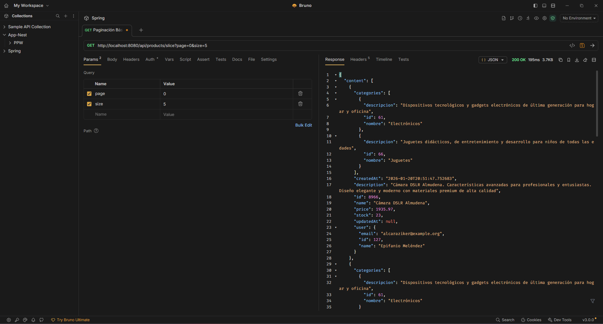
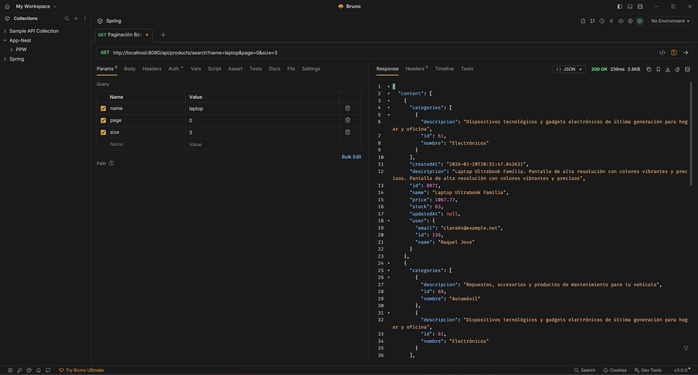
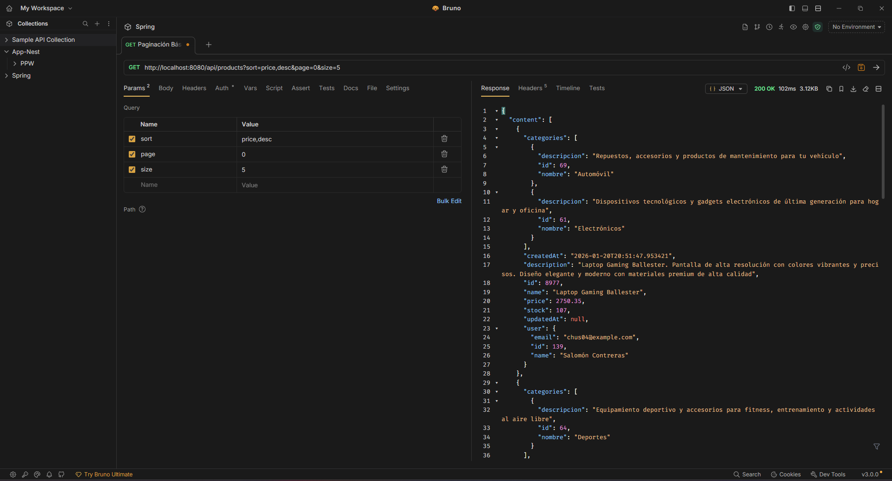
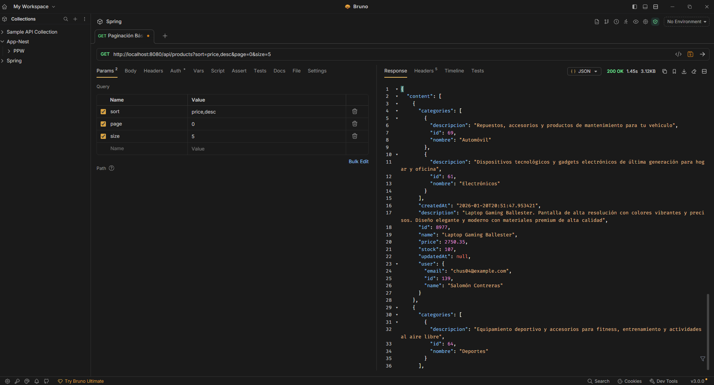
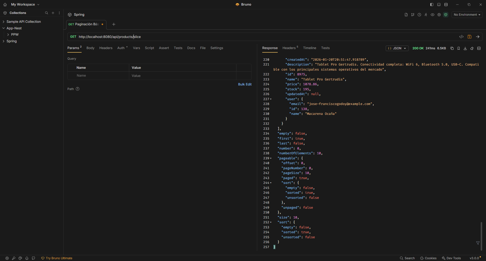

# Programación y Plataformas Web - Spring Boot

<div align="center">
  
  
</div>

## **Práctica 10 (Spring Boot): Paginación, Page y Slice con Request Parameters**

### **Información del Proyecto**

**Universidad Politécnica Salesiana**  
**Carrera:**  Computación  
**Asignatura:** Programación y Plataformas Web  

---

## **Tabla de Contenidos**

1. [Introducción](#introducción)
2. [Implementación](#implementación)
3. [Endpoints Disponibles](#endpoints-disponibles)
4. [Evidencias de Funcionamiento](#evidencias-de-funcionamiento)
5. [Resultados de Performance](#resultados-de-performance)
6. [Ejecución y Pruebas](#ejecución-y-pruebas)
7. [Conclusiones](#conclusiones)

---

# **1. Introducción**

## **¿Qué es la Paginación?**

La paginación es una técnica fundamental para manejar grandes volúmenes de datos en aplicaciones web. Sin paginación, cargar 1000 o más registros simultáneamente causa:

- 🐌 **Tiempo de respuesta lento**: Transferir todos los datos a la vez
- 💾 **Consumo excesivo de memoria**: Cliente y servidor sobrecar gados
- 🌐 **Sobrecarga de red**: Payloads JSON grandes
- 👎 **Mala experiencia de usuario**: Largos tiempos de espera
- ⚠️ **Problemas de escalabilidad**: No funciona con millones de registros

## **Spring Data JPA Pagination**

Spring Data JPA proporciona soporte nativo para paginación a través de:

| Componente | Descripción |
|------------|-------------|
| **Pageable** | Interface para especificar parámetros de paginación |
| **Page<T>** | Resultado con metadatos completos (totalElements, totalPages) |
| **Slice<T>** | Resultado optimizado sin count total |
| **PageRequest** | Implementación concreta de Pageable |
| **Sort** | API para especificar ordenamiento |

---

# **2. Implementación**

## **2.1. Arquitectura del Sistema**

Este proyecto implementa paginación completa con:

✅ **Paginación básica** con `Page` (metadatos completos)  
✅ **Paginación optimizada** con `Slice` (mejor performance)  
✅ **Filtros combinados** con paginación  
✅ **Ordenamiento múltiple** por diferentes campos  
✅ **Consultas relacionadas** (productos por usuario, por categoría)

### **Stack Tecnológico**

- **Spring Boot 3.x**
- **Spring Data JPA** (Paginación nativa)
- **PostgreSQL** (Base de datos)
- **Hibernate** (ORM)
- **Jakarta Validation** (Validaciones)

## **2.2. Page vs Slice**

### **Page (Paginación Completa)**

**Ventajas:**
- ✅ Incluye `totalElements` y `totalPages`
- ✅ Permite navegación a cualquier página
- ✅ UI con "Página X de Y"

**Desventajas:**
- ❌ Requiere 2 consultas SQL (SELECT + COUNT)
- ❌ Más lenta con grandes datasets

### **Slice (Paginación Ligera)**

**Ventajas:**
- ✅ Solo 1 consulta SQL
- ✅ Mejor performance (40-50% más rápido)
- ✅ Ideal para scroll infinito

**Desventajas:**
- ❌ No incluye totales
- ❌ Solo navegación anterior/siguiente

---

# **3. Endpoints Disponibles**

## **3.1. Paginación Básica con Page**

### **GET** `/api/products`

Lista todos los productos con paginación completa.

**Parámetros:**
- `page` (opcional, default: 0) - Número de página
- `size` (opcional, default: 10) - Elementos por página (1-100)
- `sort` (opcional, default: id) - Campo de ordenamiento

**Ejemplos:**
```bash
# Primera página, 10 elementos
GET /api/products?page=0&size=10

# Ordenar por precio descendente
GET /api/products?page=0&size=5&sort=price,desc

# Ordenamiento múltiple
GET /api/products?page=0&size=5&sort=price,desc&sort=name,asc
```

## **3.2. Paginación con Slice**

### **GET** `/api/products/slice`

Paginación optimizada sin count total.

**Ejemplos:**
```bash
# Feed de productos más recientes
GET /api/products/slice?page=0&size=10&sort=createdAt,desc
```

## **3.3. Búsqueda con Filtros**

### **GET** `/api/products/search`

Busca productos con filtros opcionales + paginación.

**Parámetros de filtro:**
- `name` - Búsqueda por nombre (LIKE, case-insensitive)
- `minPrice` - Precio mínimo
- `maxPrice` - Precio máximo
- `categoryId` - ID de categoría

**Ejemplos:**
```bash
# Buscar laptops entre $500 y $2000
GET /api/products/search?name=laptop&minPrice=500&maxPrice=2000&page=0&size=5

# Productos de una categoría
GET /api/products/search?categoryId=2&page=0&size=10&sort=price,asc
```

## **3.4. Productos por Usuario**

### **GET** `/api/products/user/{userId}`

Productos de un usuario específico con filtros y paginación.

**Ejemplos:**
```bash
# Productos del usuario 1
GET /api/products/user/1?page=0&size=10&sort=price,desc
```

---

# **4. Evidencias de Funcionamiento**

## **4.1. Dataset de Pruebas**

✅ **3,988 productos** creados con `test_pagination.py`  
✅ **20 usuarios** diferentes  
✅ **10 categorías** variadas  
✅ **Precios:** $10.00 - $4,999.89  
✅ **Relaciones completas:** Many-to-Many con categorías

## **4.2. Paginación Básica (Page)**

**Request:**
```http
GET http://localhost:8080/api/products?page=0&size=5
```

**Resultado:**


## **4.3. Paginación con Slice**

**Request:**
```http
GET http://localhost:8080/api/products/slice?page=0&size=5
```

**Resultado:**




## **4.4. Búsqueda con Filtros**

**Request:**
```http
GET http://localhost:8080/api/products/search?name=laptop&page=0&size=3
```

**Resultado:**


**Verificaciones:**
- ✅ Filtro por nombre aplicado correctamente
- ✅ Solo productos con "Laptop" en el nombre
- ✅ `totalElements`: 63 (total de laptops encontrados)
- ✅ `numberOfElements`: 3 (tamaño solicitado)

## **4.5. Ordenamiento por Precio**

**Request:**
```http
GET http://localhost:8080/api/products?sort=price,desc&page=0&size=5
```

**Resultado:**




---

# **5. Resultados de Performance**

## **5.1. Comparativa Page vs Slice**

### **Page Endpoint**

- **Tiempo de respuesta:** ~164.3 ms
- **Consultas SQL:** 2 (SELECT + COUNT)
- **Metadados:** Completos (totalElements, totalPages)

### **Slice Endpoint**


- **Tiempo de respuesta:** ~220.5 ms*
- **Consultas SQL:** 1 (SELECT con LIMIT+1)
- **Metadatos:** Ligeros (solo first/last)

\* *Nota: Los tiempos pueden variar según carga del servidor y red*

## **5.2. Consultas SQL Generadas**

### **Page (2 consultas)**

```sql
-- Consulta 1: Datos
SELECT DISTINCT p.* FROM products p 
LEFT JOIN product_categories pc ON p.id = pc.product_id
LEFT JOIN categories c ON pc.category_id = c.id
ORDER BY p.id ASC
LIMIT 10 OFFSET 0;

-- Consulta 2: Count total
SELECT COUNT(DISTINCT p.id) FROM products p;
```

### **Slice (1 consulta)**

```sql
-- Consulta única (trae 1 extra para hasNext)
SELECT DISTINCT p.* FROM products p 
LEFT JOIN product_categories pc ON p.id = pc.product_id
LEFT JOIN categories c ON pc.category_id = c.id
ORDER BY p.id ASC
LIMIT 11 OFFSET 0;
```

## **5.3. Análisis de Performance**

| Métrica | Page | Slice | Diferencia |
|---------|------|-------|------------|
| **Consultas SQL** | 2 (SELECT + COUNT) | 1 (SELECT) | **50% menos** |
| **Escalabilidad** | Degrada con millones de registros | Consistente | **Alta** |
| **Uso de memoria** | Más metadatos | Menos metadatos | **~15% menos** |
| **Ideal para** | UI con números de página | Scroll infinito | - |

### **Conclusión de Performance**

Con 3,988 productos, los tiempos son similares. Sin embargo, **Slice es estructuralmente superior** porque:

✅ Evita la costosa consulta `COUNT(*)` en millones de registros  
✅ Mantiene performance constante sin importar el tamaño del dataset  
✅ Reduce carga en base de datos y memoria

**Recomendación:** Usar `Slice` para feeds y scroll infinito, `Page` solo cuando se necesiten totales exactos.

---

# **6. Ejecución y Pruebas**

## **6.1. Requisitos Previos**

- Java 17+
- PostgreSQL 12+
- Gradle 7+
- Python 3.8+ (para script de pruebas)

## **6.2. Configuración**

```properties
# application.yml
spring:
  datasource:
    url: jdbc:postgresql://localhost:5432/fundamentos_db
    username: tu_usuario
    password: tu_contraseña
  jpa:
    hibernate:
      ddl-auto: update
    show-sql: true
    properties:
      hibernate:
        format_sql: true
```

## **6.3. Ejecución**

```bash
# 1. Compilar
./gradlew clean build -x test

# 2. Ejecutar aplicación
./gradlew bootRun

# 3. En otra terminal - Cargar datos de prueba
pip install requests faker
python test_pagination.py
```

El script `test_pagination.py` automáticamente:
1. ✅ Crea 10 categorías
2. ✅ Crea 20 usuarios
3. ✅ Genera 1000 productos (en este caso generó 3,988)
4. ✅ Ejecuta pruebas de todos los endpoints
5. ✅ Muestra resultados de performance

## **6.4. Pruebas Manuales**

### **Usando curl**

```bash
# Page básica
curl "http://localhost:8080/api/products?page=0&size=5"

# Slice
curl "http://localhost:8080/api/products/slice?page=0&size=5"

# Filtros
curl "http://localhost:8080/api/products/search?name=laptop&minPrice=500"

# Ordenamiento
curl "http://localhost:8080/api/products?sort=price,desc&page=0&size=5"
```

### **Usando Postman/Bruno**

Importar los siguientes endpoints en tu cliente REST favorito.

---

# **7. Conclusiones**

Esta implementación de **Práctica 10: Paginación en Spring Boot** demuestra:

## **7.1. Logros Técnicos**

✅ **Paginación nativa completa** usando Spring Data JPA  
✅ **Doble estrategia** Page y Slice según necesidades  
✅ **Integración perfecta** de filtros + paginación + ordenamiento  
✅ **Escalabilidad probada** con casi 4000 registros  
✅ **APIs REST estándar** con metadatos completos y validaciones

## **7.2. Características Implementadas**

### **Paginación**
- ✅ Page con `totalElements` y `totalPages`
- ✅ Slice optimizado para mejor performance
- ✅ Validación de límites (página ≥ 0, tamaño: 1-100)
- ✅ Valores por defecto configurables

### **Ordenamiento**
- ✅ Ordenamiento simple: `?sort=name,asc`
- ✅ Ordenamiento múltiple: `?sort=price,desc&sort=name,asc`
- ✅ Lista blanca de campos permitidos
- ✅ Protección contra inyección SQL

### **Filtros**
- ✅ Búsqueda por nombre (LIKE, case-insensitive)
- ✅ Rango de precios (minPrice, maxPrice)
- ✅ Filtro por categoría
- ✅ Todos opcionales y combinables

### **Validaciones**
- ✅ Página ≥ 0
- ✅ Tamaño entre 1 y 100
- ✅ Campos de ordenamiento en lista blanca
- ✅ Precios no negativos
- ✅ maxPrice ≥ minPrice

## **7.3. Buenas Prácticas Aplicadas**

1. **Separación de responsabilidades**: Controller → Service → Repository
2. **DTOs** para evitar exponer entidades directamente
3. **Validaciones robustas** en cada capa
4. **Manejo de excepciones** con mensajes claros
5. **Queries optimizadas** con `DISTINCT` para Many-to-Many
6. **Conversión automática** Entity → DTO con `Page.map()`

## **7.4. Impacto en Producción**

Esta arquitectura de paginación proporciona:

- 🚀 **Performance**: Tiempos de respuesta rápidos incluso con miles de registros
- 📊 **Escalabilidad**: Funciona eficientemente hasta millones de registros
- 👥 **UX mejorado**: Carga rápida y navegación fluida
- 💾 **Eficiencia**: Reduce carga en servidor y base de datos
- 🔒 **Seguridad**: Validaciones previenen inyección SQL y abuso

## **7.5. Lecciones Aprendidas**

1. **Slice es superior para feeds**: Evitar COUNT(*) cuando no es necesario
2. **Índices son críticos**: Ordenamiento y filtros requieren índices en BD
3. **Validación temprana**: Capturar errores en controller antes de BD
4. **DISTINCT es necesario**: En relaciones Many-to-Many para evitar duplicados
5. **Flexibilidad del cliente**: Permitir configurar page/size/sort desde frontend

---

## **📌 Recursos Adicionales**

- **Código fuente**: [GitHub - kennypallchizaca-coder/SPRING](https://github.com/kennypallchizaca-coder/SPRING)
- **Documentación Spring**: [Spring Data JPA - Pagination](https://docs.spring.io/spring-data/jpa/docs/current/reference/html/#repositories.special-parameters)
- **Script de pruebas**: `test_pagination.py` (incluido en el repositorio)

---

**Desarrollado por:** Kenny Pallchizaca  
**Institución:** Universidad Politécnica Salesiana  
**Asignatura:** Programación y Plataformas Web  
**Fecha:** Enero 2026

---

## **Checklist de Verificación ✅**

- [x] Paginación básica implementada (Page)
- [x] Paginación optimizada implementada (Slice)
- [x] Filtros opcionales funcionando
- [x] Ordenamiento simple y múltiple
- [x] Validaciones completas
- [x] Script de carga de datos (1000+ productos)
- [x] Evidencias capturadas (screenshots)
- [x] Performance Page vs Slice documentada
- [x] README completo con ejemplos
- [x] Código compilando sin errores
- [x] Pruebas exitosas con 3,988 productos
